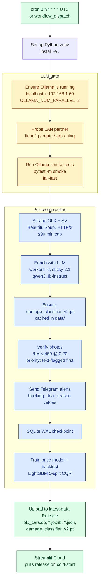
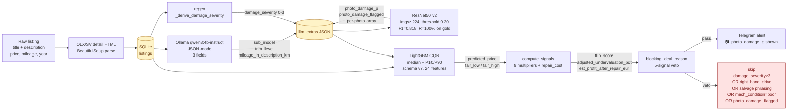

# olx-car-parser

End-to-end pipeline that scrapes Portuguese used-car listings from **OLX.pt**
and **StandVirtual**, enriches them with a local LLM, runs a vision damage
classifier on the photos, predicts a fair price with LightGBM, and Telegrams
the standout deals.

## Live dashboard

**[olx-car-parser-aaktpavdhgpbdqs4bmbdw7.streamlit.app](https://olx-car-parser-aaktpavdhgpbdqs4bmbdw7.streamlit.app/)**

Auto-deployed from `master` on every push. Reads the `latest-data` GitHub
Release as its source of truth — no LAN access, no SSH, no local DB.
Cold-starts pull the 90 MB SQLite snapshot via the GitHub CDN; subsequent
reruns use a marker-gated 2 h TTL plus an `(mtime, size)` cache key on
`@st.cache_data` so a release refresh invalidates the in-memory cache the
moment the underlying file changes.

## Pipeline

The scrape pipeline runs every 4 hours (`0 */4 * * *` UTC) on a self-hosted
macOS runner. Public scrape DB + model artifacts are uploaded to the
`latest-data` GitHub Release after every run — that's the only surface the
dashboard sees.



Concurrency: `concurrency: scrape-job, cancel-in-progress: true` — a
fresh cron firing always wins; a half-flushed older run gets killed and
its WAL cleaned up at the start of the next run.

## Data processing

Every listing flows through five enrichment layers. Each layer is
idempotent on its own column and skipped if the listing already has it,
so you can re-run any cron without redoing work.



### Models

| Stage | Model | Where | Latency | Quality |
|---|---|---|---|---|
| Text enrichment | **qwen3:4b-instruct** (Ollama) | `localhost` + `192.168.1.69` (LAN partner), sticky 2:1 routing, 6 workers | ~3-5 s/listing | 100% match vs LLM oracle on damage_severity |
| Damage from text | **regex** `_derive_damage_severity` | in-process | ~1 ms/listing | rule-based, calibrated against the 30-listing oracle |
| Photo damage | **ResNet50 v2** (`damage_classifier_v2.pt`, 90 MB) | M1 MPS or CPU | ~50 ms/photo, ~10 s/listing on the runner (network-bound) | per-photo F1=0.750 @0.30 · listing-level F1=0.818 @0.20, **R=100%** on the 51-listing gold set |
| Price estimate | **LightGBM CQR** (`price_model.joblib`) | in-process | <1 ms/listing | MAPE ~12% on the 5-split time backtest, 80% pinball coverage |
| Deal vetoer | `_blocking_deal_reason` | in-process | <1 ms | 5-signal hard veto |

### Photo damage classifier — full receipts

What lives at `damage_classifier_v2.pt` and how it was picked:

| Variant | Per-photo F1 | Listing F1 | Listing recall | Notes |
|---|---|---|---|---|
| **v2 (production)** | **0.750** @0.30 | **0.818** @0.20 | **100%** | ResNet50, CE loss, DrBimmer-binary only |
| v3_dmg4x | 0.737 @0.50 | 0.800 | 88.9% | + harvest damaged ×4, no harvest clean |
| v3_focal | 0.667 @0.30 | — | — | + harvest, focal γ=2 — *worse* (distribution shift) |
| v3_ce | 0.690 @0.30 | — | — | + harvest, CE — *worse* |
| VLM qwen2.5-vl 3b | 0.552 | 0.667 (6/9) | 67% | ~16 s/photo, 300× slower |
| VLM qwen2.5-vl 7b | 0.545 | 0.571 | 50% | smaller subset, ~30 s/photo |
| YOLOv8m-seg zero-shot | 0.250 | — | 17% | deleted |
| YOLOv8m-seg fine-tune | 0.10–0.13 | — | 100%* (over-predicts) | deleted |

The harvest experiments (`combined_v1` / `combined_v2` builds) are kept
in the repo for re-runs, but the v2 baseline is what ships — adding
OLX-domain damage photos shifted the decision boundary toward "extreme
salvage features" and silently dropped sev=1 cosmetic-damage listings.
See the commit log for the post-mortem.

### Threshold sweep (gold, 51 listings, 9 damaged)

| Threshold | TP | FP | FN | Precision | Recall | F1 |
|---|---|---|---|---|---|---|
| 0.10 | 9 | 7 | 0 | 56.3% | 100% | 0.720 |
| 0.15 | 9 | 5 | 0 | 64.3% | 100% | 0.783 |
| **0.18 – 0.20** | **9** | **4** | **0** | **69.2%** | **100%** | **0.818** |
| 0.30 | 7 | 3 | 2 | 70.0% | 78% | 0.737 |
| 0.50 | 5 | 2 | 4 | 71.4% | 56% | 0.625 |

Production runs at `0.20` — bias toward recall is the right call for a
veto signal that gets cross-checked against text damage_severity in
`_blocking_deal_reason`.

### Inputs / outputs

- **Persistent state** lives on the scrape host as `data/olx_cars.db`
  (SQLite, ~90 MB at steady state). The host runs the GitHub Actions
  self-hosted runner and is the only thing that writes.
- **Per-listing photo signal**: stored as JSON keys `photo_damage_p`,
  `photo_damage_flagged`, and `photo_damages` *inside* the existing
  `llm_extras` column — no schema migration.
- **Photo cache**: `/tmp/photo_verify/cache/{olx_id}/{i}.jpg` — survives
  for the cron runtime, not persisted across runs.
- **Release artifacts**: `latest-data` carries the DB, the price model
  bundle, training metrics, and the damage classifier weights. This is
  the **only** surface the Streamlit Cloud dashboard reads from.

## Layout

```
src/
├── cli.py                  # Typer entrypoint — all the `python -m src.cli ...` commands
├── parser/
│   ├── scraper.py          # OLX + SV crawl (BeautifulSoup, HTTP/2)
│   ├── llm_enrichment.py   # Ollama client, sticky-per-thread routing, JSON-mode prompts
│   ├── photo_damage.py     # ResNet50 wrapper — DamageClassifier
│   └── damage_decision.py  # torch-free flag rules — imported by the dashboard
├── analytics/
│   ├── price_model.py      # LightGBM CQR pipeline + features
│   ├── model_eval.py       # 5-split time backtest
│   └── computed_columns.py # depreciation / liquidity / per-segment stats
├── dashboard/
│   ├── app.py              # Streamlit Cloud entrypoint
│   ├── data_loader.py      # release-asset sync, compute_signals, _blocking_deal_reason
│   └── visualizations.py   # plotly charts
└── alerts/
    └── telegram_bot.py     # deal alerts, format_deal

scripts/
├── rederive_damage_severity.py        # rule-based severity backfill (no LLM)
├── photo_verify_damage.py             # dry-run photo verification (JSON report)
├── photo_damage_classifier_eval.py    # eval against gold-labelled holdout
├── train_damage_classifier.py         # retrain v2/v3 — CE / weighted / focal
└── build_harvest_imagefolder.py       # rebuild ImageFolder dataset

tests/
├── test_*.py                          # unit + integration suite
├── test_release_cache.py              # marker-gated TTL + CDN fallback
└── test_ollama_integration.py         # live smoke marker (needs Ollama on LAN)
```

## License

Personal project — code is here for reference, no license granted.
