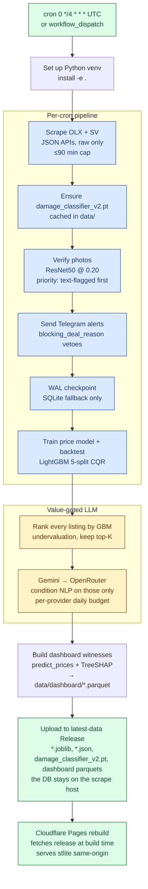

# olx-car-parser

End-to-end pipeline that scrapes Portuguese used-car listings from **OLX.pt**
and **StandVirtual**, prices them with LightGBM, runs a vision damage
classifier on the photos, reads the descriptions of the top-ranked deals with
a cloud LLM, and Telegrams the standout ones.

## Live dashboard

**[olx-car-parser.permikov134.workers.dev](https://olx-car-parser.permikov134.workers.dev/)**

A Streamlit app running entirely in the visitor's browser via
[stlite](https://github.com/whitphx/stlite) (Pyodide), hosted as static
assets on Cloudflare Pages. Auto-deploys from `master` on every push;
``scripts/build_stlite_bundle.py`` copies the Python source into the
bundle and downloads the latest witness parquets from the `latest-data`
GitHub Release at build time, so the entire dashboard ships same-origin
and starts cold in ~25 s. No server, no sleep, no auth.

The deal-scoring inference pipeline (LightGBM predict + TreeSHAP +
anomaly + hazard) does **not** run in the browser — it's baked into
parquet witnesses in CI (`scripts/build_dashboard_data.py`, fired by
``scrape-ci`` after `train-model`).

## Pipeline

The scrape pipeline runs every 4 hours (`0 */4 * * *` UTC) on a self-hosted
macOS runner. Public scrape DB + model artifacts are uploaded to the
`latest-data` GitHub Release after every run — that's the only surface the
dashboard sees.


```mermaid
flowchart TD
    Cron[cron 0 */4 * * * UTC<br/>or workflow_dispatch] --> Setup
    Setup[Set up Python venv<br/>install -e .] --> Scrape

    subgraph Pipeline [Per-cron pipeline]
      direction TB
      Scrape[Scrape OLX + SV<br/>JSON APIs, raw only<br/>≤90 min cap] --> Weights[Ensure damage_classifier_v2.pt<br/>cached in data/]
      Weights --> Verify[Verify photos<br/>ResNet50 @ 0.20<br/>priority: text-flagged first]
      Verify --> Alerts[Send Telegram alerts<br/>blocking_deal_reason vetoes]
      Alerts --> Checkpoint[WAL checkpoint<br/>SQLite fallback only]
      Checkpoint --> Train[Train price model + backtest<br/>LightGBM 5-split CQR]
    end

    Train --> Enrich

    subgraph LLMStep [Value-gated LLM]
      direction TB
      Enrich[Rank every listing by GBM<br/>undervaluation, keep top-K] --> Cascade[Gemini → OpenRouter<br/>condition NLP on those only<br/>per-provider daily budget]
    end

    Cascade --> Witnesses[Build dashboard witnesses<br/>predict_prices + TreeSHAP<br/>→ data/dashboard/*.parquet]
    Witnesses --> Upload[Upload to latest-data Release<br/>*.joblib, *.json,<br/>damage_classifier_v2.pt, dashboard parquets<br/>the DB stays on the scrape host]
    Upload --> Dashboard[Cloudflare Pages rebuild<br/>fetches release at build time<br/>serves stlite same-origin]

    classDef gate fill:#fef3c7,stroke:#92400e,color:#78350f
    classDef step fill:#dbeafe,stroke:#1e40af,color:#1e3a8a
    classDef terminal fill:#dcfce7,stroke:#166534,color:#14532d
    class Enrich,Cascade gate
    class Scrape,Weights,Verify,Alerts,Checkpoint,Train step
    class Cron,Upload,Dashboard terminal
```

Concurrency: `concurrency: scrape-job, cancel-in-progress: true` — a
fresh cron firing always wins; a half-flushed older run gets killed and
its WAL cleaned up at the start of the next run.

## Data processing

Every listing flows through five enrichment layers. Each layer is
idempotent on its own column and skipped if the listing already has it,
so you can re-run any cron without redoing work.


```mermaid
flowchart LR
    A[Raw listing<br/>title + description<br/>price, mileage, year] --> B
    B[OLX/SV detail HTML<br/>BeautifulSoup parse] --> C
    C[(PostgreSQL<br/>listings)]:::db

    C --> V[value gate<br/>GBM ranks every listing<br/>top-K undervalued only]
    V --> D
    D[Gemini flash → OpenRouter<br/>JSON mode, condition NLP]
    D -->|sub_model · trim_level · mileage<br/>mechanical_condition · accident<br/>owners · warranty · urgency| E

    C --> R[regex<br/>_derive_damage_severity]
    R -->|damage_severity 0-3| E

    E[(llm_extras JSON)]:::db
    E --> F

    F[ResNet50 v2<br/>imgsz 224, threshold 0.20<br/>F1=0.818, R=100% on gold]
    F -->|photo_damage_p<br/>photo_damage_flagged<br/>per-photo array| E

    C --> G
    E --> G
    G[LightGBM CQR<br/>median + P10/P90<br/>schema v7, 24 features]
    G -->|predicted_price<br/>fair_low / fair_high| H

    H[compute_signals<br/>9 multipliers + repair_cost]
    H -->|flip_score<br/>adjusted_undervaluation_pct<br/>est_profit_after_repair_eur| I

    I[blocking_deal_reason<br/>5-signal veto]
    I -->|pass| J[Telegram alert<br/>📷 photo_damage_p shown]
    I -->|veto| X[skip<br/>damage_severity≥3<br/>OR right_hand_drive<br/>OR salvage phrasing<br/>OR mech_condition=poor<br/>OR photo_damage_flagged]:::veto

    classDef db fill:#fef3c7,stroke:#a16207,color:#713f12
    classDef veto fill:#fee2e2,stroke:#991b1b,color:#7f1d1d
```

### Models

| Stage | Model | Where | Latency | Quality |
|---|---|---|---|---|
| Text enrichment | **gemini-flash-latest** → OpenRouter free models | cloud, cascade with per-provider daily budget | ~3-8 s/listing | top-K deals only (~20/run), never the whole corpus |
| Damage from text | **regex** `_derive_damage_severity` | in-process | ~1 ms/listing | rule-based, calibrated against the 30-listing oracle |
| Photo damage | **ResNet50 v2** (`damage_classifier_v2.pt`, 90 MB) | M1 MPS or CPU | ~50 ms/photo, ~10 s/listing on the runner (network-bound) | per-photo F1=0.750 @0.30 · listing-level F1=0.818 @0.20, **R=100%** on the 51-listing gold set |
| Price estimate | **LightGBM CQR** (`price_model.joblib`) | in-process | <1 ms/listing | MAPE ~12% on the 5-split time backtest, 80% pinball coverage |
| Deal vetoer | `_blocking_deal_reason` | in-process | <1 ms | 5-signal hard veto |

### Photo damage classifier — full receipts

What lives at `damage_classifier_v2.pt` and how it was picked:

| Variant | Per-photo F1 | Listing F1 | Listing recall | Notes |
|---|---|---|---|---|
| **v2 (production)** | **0.750** @0.30 | **0.818** @0.20 | **100%** | ResNet50, CE loss, DrBimmer-binary only |
| v3_dmg4x | 0.737 @0.50 | 0.800 | 88.9% | + harvest damaged ×4, no harvest clean |
| v3_focal | 0.667 @0.30 | — | — | + harvest, focal γ=2 — *worse* (distribution shift) |
| v3_ce | 0.690 @0.30 | — | — | + harvest, CE — *worse* |
| VLM qwen2.5-vl 3b | 0.552 | 0.667 (6/9) | 67% | ~16 s/photo, 300× slower |
| VLM qwen2.5-vl 7b | 0.545 | 0.571 | 50% | smaller subset, ~30 s/photo |
| YOLOv8m-seg zero-shot | 0.250 | — | 17% | deleted |
| YOLOv8m-seg fine-tune | 0.10–0.13 | — | 100%* (over-predicts) | deleted |

The harvest experiments (`combined_v1` / `combined_v2` builds) are kept
in the repo for re-runs, but the v2 baseline is what ships — adding
OLX-domain damage photos shifted the decision boundary toward "extreme
salvage features" and silently dropped sev=1 cosmetic-damage listings.
See the commit log for the post-mortem.

### Threshold sweep (gold, 51 listings, 9 damaged)

| Threshold | TP | FP | FN | Precision | Recall | F1 |
|---|---|---|---|---|---|---|
| 0.10 | 9 | 7 | 0 | 56.3% | 100% | 0.720 |
| 0.15 | 9 | 5 | 0 | 64.3% | 100% | 0.783 |
| **0.18 – 0.20** | **9** | **4** | **0** | **69.2%** | **100%** | **0.818** |
| 0.30 | 7 | 3 | 2 | 70.0% | 78% | 0.737 |
| 0.50 | 5 | 2 | 4 | 71.4% | 56% | 0.625 |

Production runs at `0.20` — bias toward recall is the right call for a
veto signal that gets cross-checked against text damage_severity in
`_blocking_deal_reason`.

### Inputs / outputs

- **Persistent state** lives on the scrape host in PostgreSQL (database
  `olx_cars`, ~370 MB at steady state). Every entry point picks its engine
  from `OLX_DB_URL` and falls back to a local `data/olx_cars.db` SQLite file
  when it is unset. The host runs the GitHub Actions self-hosted runner and
  is the only thing that writes.
- **Per-listing photo signal**: stored as JSON keys `photo_damage_p`,
  `photo_damage_flagged`, and `photo_damages` *inside* the existing
  `llm_extras` column — no schema migration.
- **Photo cache**: `/tmp/photo_verify/cache/{olx_id}/{i}.jpg` — survives
  for the cron runtime, not persisted across runs.
- **Release artifacts**: `latest-data` carries the price model bundle,
  training metrics, the damage classifier weights, and the dashboard
  witness parquets — never the database itself. Cloudflare Pages reads the
  dashboard parquets at build time and ships them same-origin; the model /
  weights are server-side artifacts the next scrape uses.

## Layout

```
src/
├── cli.py                  # Typer entrypoint — all the `python -m src.cli ...` commands
├── parser/
│   ├── scraper.py          # OLX + SV crawl (BeautifulSoup, HTTP/2)
│   ├── llm_enrichment.py   # domain rules for extracted facts (validation, corrections)
│   ├── cloud_enrichment.py # Gemini → OpenRouter cascade + per-provider budget ledger
│   ├── tls_fingerprint.py  # the ClientHello every OLX-facing client must use
│   ├── photo_damage.py     # ResNet50 wrapper — DamageClassifier
│   └── damage_decision.py  # torch-free flag rules — imported by the dashboard
├── analytics/
│   ├── value_gate.py       # ranks listings by GBM undervaluation → top-K for the LLM
│   ├── price_model.py      # LightGBM CQR pipeline + features
│   ├── model_eval.py       # 5-split time backtest
│   └── computed_columns.py # depreciation / liquidity / per-segment stats
├── dashboard/
│   ├── 🔥_Recommendations.py   # stlite entry — deal-cards home page
│   ├── pages/
│   │   ├── 2_📈_Market_Direction.py
│   │   └── 3_🔍_Model_Details.py
│   ├── _cache.py               # @st.cache_data wrappers shared across pages
│   └── data_loader.py          # parquet fetch + compute_signals + _blocking_deal_reason
└── alerts/
    └── telegram_bot.py         # deal alerts, format_deal

dashboard-static/               # CF Pages static bundle
├── index.html                  # stlite mount config (pinned @stlite/browser 1.7.x)
├── README.md                   # one-time CF Pages setup
└── files/, data/               # build outputs from build_stlite_bundle.py (gitignored)

scripts/
├── rederive_damage_severity.py        # rule-based severity backfill (no LLM)
├── photo_verify_damage.py             # dry-run photo verification (JSON report)
├── photo_damage_classifier_eval.py    # eval against gold-labelled holdout
├── train_damage_classifier.py         # retrain v2/v3 — CE / weighted / focal
└── build_harvest_imagefolder.py       # rebuild ImageFolder dataset

tests/
├── test_*.py                          # unit + integration suite
├── test_release_cache.py              # marker-gated TTL + CDN fallback
├── test_cloud_enrichment.py           # value gate, provider cascade, budget ledger
└── test_tls_fingerprint.py            # OLX handshake (+ a live `-m smoke` check)
```

## License

Personal project — code is here for reference, no license granted.
